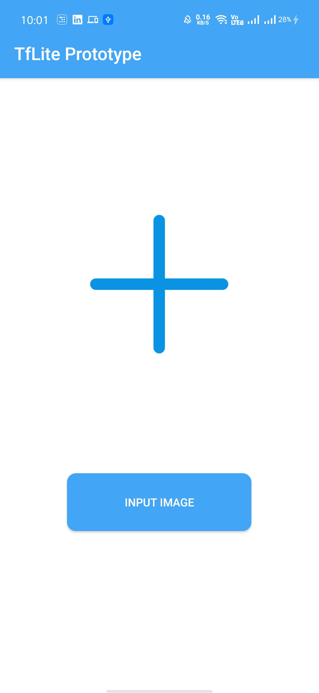
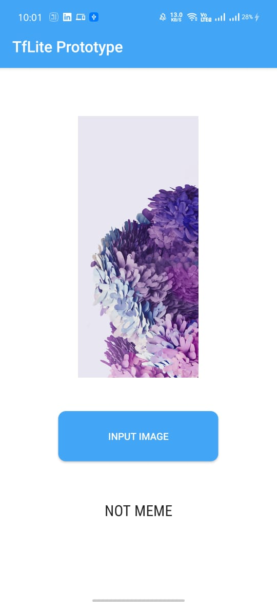
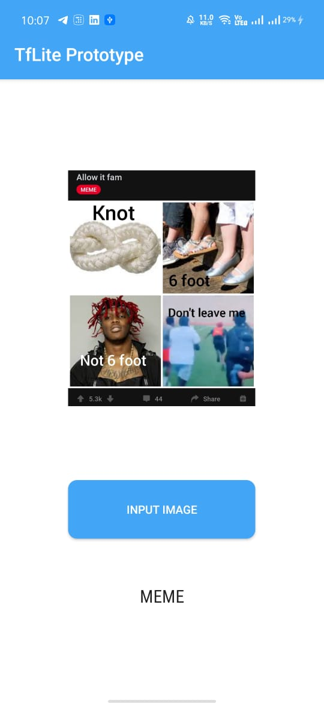

# Meme vs Non Meme Android App Using TFlite

This is an Android app that classifies whether the image is a __Meme or Not a Meme__.

The machine learning model is implemented using the Tensorflow Lite library which is meant for running Machine Learning models on Android Devices .

- TensorFlow Lite is a set of tools to help developers run TensorFlow models on mobile, embedded, and IoT devices.
- This is an prototype for integrating [TensorFlow Lite](https://www.tensorflow.org/mobile/tflite/) into Android application.

  

Type of Classification done here is **Binary Classification.**

The model is present in the **assets folder** with an extension of tflite

**Find this project useful ?**

- Click the ⭐️ button.
